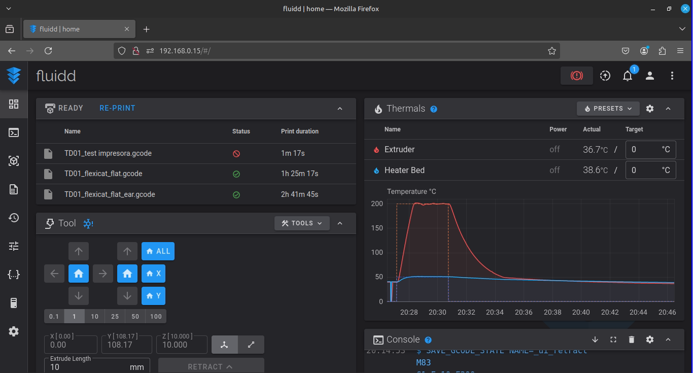
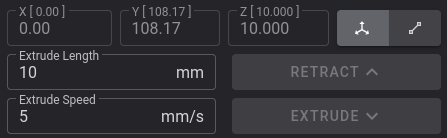
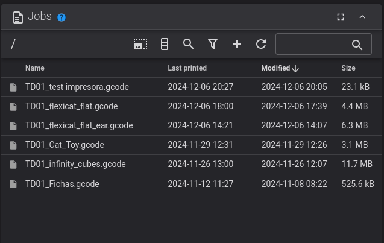

# Documentación de Klipper en UTN FRRo

Este repositorio tiene la intención de establecer la documentación pertinente a la instalación, configuración y guía de uso del firmware Klipper en las impresoras 3D de la UTN-FRRo.

Toda la información utilizada en este proceso fue suministrada por la página oficial de [Klipper](https://www.klipper3d.org/), su [repositorio](https://github.com/Klipper3d/klipper) y distintos foros públicos como [Reddit](https://www.reddit.com/r/klippers/) y la [Wiki](https://tronxy.fandom.com/wiki/Installing_Klipper) de Tronxy para instalar Klipper.

## 0. Información previa

 Antes de realizar cualquier manipulación del firmware original de las impresoras ([Marlin](https://github.com/MarlinFirmware/Marlin)), es recomendable realizar/obtener una copia del mismo por cuestiones de seguridad. 

 Tener preparado un dispositivo capaz de correr una distribución de Linux cualquiera, esta a su vez debe de ser capaz de correr Python 3.8 (sujeto a modificaciones segun Klipper, en un futuro puede ser alguna version mas nueva). Esta distribción se justa a limitaciones del dispositivo (hardware) o gusto de la persona.

Hasta el momento no hay requisitos mínimos muy claros, pero según experimentos hechos de forma autónoma para ejecutar una sola interfaz (1 dispositivo, 1 impresora) debe ser un sistema que tenga las siguientes especificaciones:

- Arquitectuta x86_64 o x64
- Procesador de 2 núcleos
- 2GB de ram DDR3

También tener cable para realizar la conexión entre la impresora y el dispositivo.

Cabe aclarar que se menciona "dispositivo" porque es posible correrlo en un dispositivo Android.

Tener un mínimo conocimiento del manejo en sistemas Linux, sobre todo el uso de la terminal.

## 1. Instalación

Teniendo preparados los requisitos previos, se utilizó la interfaz de instalación [KIAUH](https://github.com/dw-0/kiauh), de ésta se instala minimamente en el dispositivo a ejecutar el host:

-  Klipper
-  Moonraker (Servidor web basado en Python)
-  Una interfaz gráfica (Mainsail o Fluidd).

Posteriormente se debe generar el archivo .bin que contiene el firmware Klipper para la impresora; dentro de la carpeta kiauh se ejecuta el comando:
 
 ~~~
 make menuconfig
 ~~~

 Se despliega una interfaz gŕafica que permite seleccionar los parametros de la motherboard de la impresora. Dichos parametros van variando segun la placa y el procesador que contiene la misma. Para nuestro caso las placas son:

 - CXY-446-V6-191121
 - CXY-446-V10
  
Siguiendo la guia de la wiki, se copia la configuracion para una placa tipo 446 con bootloader de 64Kb,se guardan los cambios y se ejecuta el comando:

~~~
make
~~~

> [!WARNING]
> Si se utiliza el dispositivo para generar multiples configraciones distintas, al finalizar, se debe volver a generar la configuracion de la impresora a la cual va a estar conectado.

Este proceso genera varios archivos en la carpeta /klipper/out, solo se copia el .bin y se pone en una sd en una carpeta llamada "update", se conecta la sd a la impresora, se prende y si todo salio correctamente, la pantalla queda con una barra de carga en la parte inferior quedando inutilizable.

Se ingresa desde un navegador buscando "localhost" en caso de conexiones ethernet, si fuera por WiFi, a través de la dirección IPv4 que brinda el modem.

## 2. Configuración inicial

Se accede a la pestaña de "Configuración" y se procede a modificar el archivo "printer.cfg"

La configuración de la impresora depende pura y exclusivamente de la placa, el procesador y el modelo de la impresora. Con el pasar de los años se encuentran muchas configuraciones gratuitas disponibles en el repositorio de Klipper o en foros.

> [!WARNING]
> NINGUNA DE LAS CONFIGURACIONES PRESENTA EL AJUSTE DEL Z_OFFSET, SE DEBE HACER POSTERIORMENTE, PUEDE VARIAR ENTRE IMPRESORA POR MÁS QUE SEAN LA MISMA.

Lo que importan de éstas son el seteo de pines para los movimientos de los ejes, sensores de temperatura, flujo del extrusor, etc.

Lo que se debe configurar dependiendo la impresora son las dimensiones, estas estan escritas en mm.

> [!NOTE]
> Antes de realizar cualquier moviemiento de ejes, configurar dimensiones y probar moviendo uno a la vez. En caso de mal movimiento, presionar el boton de "frenado" que se encuentra en la esquina superior derecha

Si se aprecia que todo se encuentra correctamente funcionando y no se presentan errores, Klipper esta listo para utilización.

## 3. Uso básico

Recomiendo revisar tanto documentación oficial de Klipper como de Fluidd en caso de no comprender algo.

En general Klipper funciona por acciones, una vez que se ejecuta algo no se puede ejecutar otra cosa simultáneamente (aunque si se puede cancelar de una manera brusca "apagando" la impresora con el botón de "frenado" que previamente mencioné). Claro ejemplo de esto podría ser cuando quiero pausar una impresión, hasta que la acción no se termine, no voy a poder resumir o cancelar la impresión. 

#### 3.1. Movimiento en la interfaz

Una vez entrando a la interfaz de Fluidd que se utiliza para interactuar con la impresora, la vista será como la siguiente imagen.

Desde la sección "Tool" se puede mover el cabezal a gusto, también hacer la acción de "home" para volver a la posicion básica (coordenadas 0, exceptuando el eje Z que va al medio).

#### 3.2. Temperaturas

Desde la sección "Thermals" se ajustan las temperaturas del extrusor y cama, respectivamente.

Se utiliza generalmente para hacer al cambio de filamento. Cuando se inicia una impresión, automaticamente se pone la temperatura que este seteada en el G-Code.

#### 3.3. Filamento

> [!WARNING]
> Para realizar cambio de filamento, ya sea por falta o cambio de color, se debe poner la temperatura del extrusor a minimante 170°C, con esto hecho, los botones de "Retract" y "Extrude" se activan.

Desde la sección "Tool" en la parte que yo describo como "hotend panel" se debe poner la Extrude Lenght en alrededor de 120mm y presionar "Retract" para quitar el filamento dentro del hotend; posteriormente con el nuevo filamento ya preparado, se presiona "Extrude" y se coloca el filamento para que la impresora lo extruya.

> [!NOTE]
> Recordar de dejar la temperatura tal como se puso, ya que al reanudar la impresión, el movimiento para continuar es instanteo y la impresora automaticamente va a actualizar su temperatura a una previamente guardada desde que se quedó sin filamento o se realizó una pausa.

> [!NOTE]
> A futuro se podria hacer una macro de esto pero lo considero medio innecesario ya que desde la interfaz en general puedo ajustar la retracción/extrusión a medida según necesite.

#### 3.4. G-Codes

En la seccion "Jobs" se pueden agregar los G-Codes que se utilizarán para imprimir desde el signo +.

Desde acá se pueden iniciar las impresiones.

#### 3.5. Calibración

Por lo general esto se hace 1 sola vez, se puede hacer más veces en casos de mantenimiento o cuando se considere conveniente.

La calibración depende del tipo de impresora y si presenta sensor o no. Existe la opción de calibracion en su pestaña propia y se puede apreciar un grafico de desnivel en las coordenadas que se toma valor de distancia del z_offset (que tecnicamente es el desface del z_endstop).

En el caso de las D01, no tienen sensor, por lo que se hace el "paper test" mencionado en la pagina de Klipper.

Para realizar el ajuste de tornillos, se debe configurar en la seccion [bed_screws] de la cfg de la impresora, las coordenadas XY de los tornillos; para obtener dichas coordenadas, se mueve el cabezal manualmente desde la interfaz de Klipper y se deja la punta del extrusor lo más cercano posible sobre la punta del tornillo en la cama, se repite el proceso con cada tornillo, se debe empezar por el de abajo-izquierda (screw1) y anotarlos en sentido antihorario.

Posteriormente se ejecuta la acción BED_SCREWS_ADJUST desde consola o desde el botón "tools" dentro de la sección "Tool" y se realiza el "paper test" en cada tornillo ajustándolo para que cumpla con la condición de dicho test, que haya un fricción mínima, luego de ajustarlos se realiza el paper test en el centro de la cama con el comando Z_ENDSTOP_CALIBRATE.

Para la X5SA, se puede hacer el paper test pero como ésta sí tiene un sensor, se realiza la calibración mediante PROBE_CALIBRATE (recordar acomodar bien los screws) en consola y posteriormente se hace un "paper test" en el centro.

## 4. Macros

Lo más destacable que tiene Klipper, es la creación de macros a traves de G-Code y el sistema de programación de Jinja2 (que ofrece seteo de variables, condicionales y demás utilidades para trabajar con macros).

Esta sección no esta muy explorada por parte de la cátedra y los alumnos, ya que lleva demasiado tiempo y requiere indagar en ambas tecnologías mencionadas.

Gran parte, por no decir todas las macros, ya existen o tienen algun parecido con otra, generalmente se buscan y se editan según necesidad. Recalco revisar bien la sección de [macros](https://www.klipper3d.org/Command_Templates.html) aunque no es muy explicativa, da una tentativa de inicio al mundo.

Lo único realizado hasta el momento, son modificaciones de las funciones PAUSE, RESUME y CANCEL_PRINT, para que si en algún momento hay que pausar la impresión o si la impresora se queda sin filamento el cabezal se mueva a una coordenada segura, se apague el hotend y se mantenga prendida la cama por 10 dias, para que haya suficiente tiempo en cambiar filamento/resolver problema si llega a haber paros o cualquier inconveniente con la universidad que imposibilite ir.

Existen carpetas de macros como [esta](https://github.com/jschuh/klipper-macros) que se pueden implementar en cierto caso.

## 5. Extras y trabajo a futuro

Ante cualquier futura modificación o trabajo que requiera el conocimiento de los pines, pueden utilizar esta [imagen](pinmap_STM32F446.jpg) adjuntada en el repositorio; aunque generalmente la solución esta en algún foro, es útil para algún caso en específico.

Cualquier modificación a este repositorio o dudas sobre Klipper, comunicarse con José Ignacio Stassi (joseignaciostassi@gmail.com).

Como trabajo para próximos meses/años queda:

- Mantenimiento de este repositorio.
- Revisar las cfgs de las impresoras, ya que al hacerlas en "poco tiempo" puede que haya código extra que no tenga utilidad alguna o que ciertos parametros esten mal puestos (más que todo tema dimensiones de cama).
- Testear el manejo de varias impresoras con 1 sola PC (hasta el momento estamos limitados por hardware).
- Aprender G-Code y Jinja2 para desarrollo de macros interesantes para el entorno (quizás alguna para la extrusión).
- Continuación del trabajo presentado a CONAIISI 2024 sobre Eficiencia de Klipper para la Fabricación Aditiva, ya sea con mejores testeos (figuras mas complejas, distintos tamaños) o uso de distintos filamentos, ya que hasta el momento no hemos probado con estructuras más complejas (muchas curvas, curvas muy cerradas o diseños raros/no convencionales como figuras no uniformes).
- Relacionado a puntos anteriores, se podría desarrollar un trabajo sobre eficiencia en relación a hardware, ver si es un factor limitante o no en la velocidad o calidad de la impresión, testear con 1 interfaz vs +2, etc.